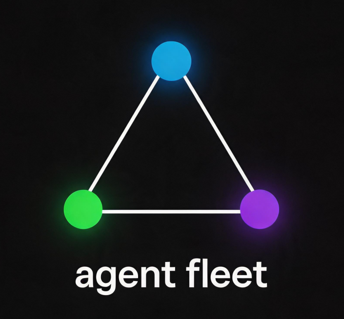

<p align="center"></p>

# Agent Fleet

> AI 开发团队的 CI/CD 管道 — 高级工程师 + QA 测试员 + 代码审查员同时在为你工作

> [English](README_EN.md) | 中文

[](LICENSE)
[](https://www.python.org/downloads/)

---

## 目录

- [这是什么](#这是什么)
- [文件放在哪里](#文件放在哪里)
- [安装与部署](#安装与部署)
- [使用场景](#使用场景)
- [Dashboard 怎么看](#dashboard-怎么看)
- [配置参考](#配置参考)
- [常见问题](#常见问题)

---

## 这是什么

Agent Fleet **不是** AI agent。它是一层编排管道，架在 Claude Code / Cursor / Codex 上面：

- 帮你把需求拆成编码、测试、验收三个角色的子任务
- 自动派发独立 Agent 并行执行
- 实时 Dashboard 展示每个 Agent 的思考过程和产出
- 测试不通过自动通知编码 Agent 修复
- 验收不通过自动循环迭代（最多 5 轮）
- 全部完成后生成执行报告

**一句话**：写代码的 Agent 不测自己，测试的 Agent 不改代码，验收的 Agent 只对需求负责。三个独立大脑互相制衡。

### 和直接调 Claude 的区别

| 直接调 Claude | 用 Agent Fleet |
|---|---|
| 一个大脑写代码、自己测、自己验收 | 三个独立大脑互相制衡 |
| 不知道进度，只能看聊天记录 | Dashboard 实时可视化所有 agent |
| 测试和验收靠自觉 | 阶段关卡强制验证，缺文件不进下一阶段 |
| 日志手动翻找 | Git diff 变更追踪 + WebSocket 实时推送 |

### 亮点

- **真并行**：ThreadPoolExecutor + 依赖拓扑排序，coder 互不阻塞
- **事件驱动**：`events.ndjson` 是唯一真相源，不靠日志关键词猜状态
- **验收闭环**：JSON verdict 结构判定，最多 5 轮自动重试
- **数据可靠**：原子写入 + 线程安全 + 路径防护，29 个测试保证

---

## 文件放在哪里

Agent Fleet 把文件分两类，各放各的：

```
D:\my-data\                    ← 管道数据目录（一次性配好）
├── .fleet\                    ← 所有日志、报告、状态
│   ├── run-20260604-120000\
│   │   ├── plan.json          ← 拆分计划
│   │   ├── status.json        ← 当前进度
│   │   ├── progress.log       ← 时间线
│   │   ├── FINAL_REPORT.md    ← 综合报告
│   │   ├── analysis/          ← 需求分析报告
│   │   ├── roles/             ← Agent 角色定义
│   │   ├── coder-01/
│   │   │   ├── output.log     ← Agent 思考过程
│   │   │   ├── prompt.md      ← Agent 完整提示词
│   │   │   └── result.md      ← Agent 产出
│   │   └── tester-01/
│   │       ├── output.log
│   │       └── test-report.md
│   └── run-20260604-150000/
│
└── agent-fleet-pro\           ← Dashboard 代码在这里

D:\my-project\                 ← 你的项目 1（Agent 写代码到这里）
└── main.py

D:\another-project\            ← 你的项目 2
└── ...
```

**核心原则**：Dashboard 部署一次不动，管道数据统一存一处。代码产在哪个项目就写到哪里。

---

## 安装与部署

### 第一步：克隆项目

```bash
git clone https://github.com/hhhwdt/agent-fleet-pro.git
cd agent-fleet-pro
```

### 第二步：安装 Skill（Claude Code 用户）

SKILL.md 是 Claude Code 的编排指令。把它放到 skills 目录：

**Windows：**
```powershell
mkdir %USERPROFILE%\.claude\skills\agent-fleet-pro
copy SKILL.md %USERPROFILE%\.claude\skills\agent-fleet-pro\SKILL.md
```

**macOS / Linux：**
```bash
mkdir -p ~/.claude/skills/agent-fleet-pro
cp SKILL.md ~/.claude/skills/agent-fleet-pro/SKILL.md
```

然后**打开 SKILL.md**，找到这两行，改成你自己的目录：

```
| `FLEET_DIR` | D:\你的数据目录\.fleet\ |
```

### 第三步：部署 Dashboard（只做一次，常驻后台）

安装 Python 依赖：

```bash
pip install -e .
```

编辑 `config.yaml`，**把 `work_dir` 设成你数据目录的父目录**（就是 `.fleet/` 在的那个目录）：

```yaml
# config.yaml
work_dir: "D:\\my-data"        # .fleet/ 会出现在这个目录下
port: 8765                      # Dashboard 端口，可以改
```

启动 Dashboard：

```bash
agent-fleet dashboard
```

看到这个输出就成功了：

```
[Agent Fleet] http://127.0.0.1:8765  (WebSocket enabled)
```

浏览器打开 `http://localhost:8765`，应该看到一个深色控制台界面。

如果想让 Dashboard 开机自启，Windows 上可以把它加到启动文件夹，Linux/macOS 上可以用 `systemd` 或 `launchd`。

### 第四步：验证安装

打开**任意一个 Claude Code 会话**（哪个目录都行），输入：

```
/agent-fleet-pro 做一个 Hello World Python 脚本
```

然后切到 Dashboard 的浏览器窗口，应该能看到一条新的运行记录出现，里面有拆分计划和 Agent 执行进度。

**如果 Dashboard 看不到运行记录**，检查：
1. `config.yaml` 里的 `work_dir` 和 SKILL.md 里的 `FLEET_DIR` 指向同一个目录
2. Dashboard 正在运行（浏览器能打开 `localhost:8765`）
3. 那个目录下已经出现了 `.fleet/run-xxx/` 文件夹

---

## 使用场景

### 场景 1：从零建一个新项目

```bash
# 1. 开 Claude Code，进入你想放代码的目录
cd D:\projects
claude

# 2. 一句话启动
/agent-fleet-pro 做一个博客系统，Go 后端 + Vue 前端
```

Claude Code 自动：拆分任务 → 并行派 3 个 coder → 测试 → 验收 → 生成报告。

代码产在 `D:\projects\` 下，管道数据在 `D:\my-data\.fleet\`。

### 场景 2：给已有项目加功能 + 需求文档

```bash
# 进入已有项目
cd D:\existing-project
claude

# 传入需求文档
/agent-fleet-pro ./docs/登录功能需求.md
# 或传 URL
/agent-fleet-pro https://wiki.your-company.com/req/LOGIN-2024
```

Agent Fleet 会先启动**需求分析 Agent**：
1. 读取需求文档
2. 扫描现有项目结构
3. 输出分析报告（影响范围、技术方案、风险）

然后基于分析报告拆分任务并执行。

### 场景 3：同时跑多个项目

```bash
# 终端 1：项目 A
cd D:\project-a && claude
/agent-fleet-pro 修 bug：用户列表加载太慢

# 终端 2：项目 B
cd D:\project-b && claude
/agent-fleet-pro 加导出 CSV 功能
```

两条任务都出现在**同一个 Dashboard** 里，各自独立运行，互不干扰。代码各自产在各自的 `project-a` 和 `project-b` 下。

### 场景 4：只想要管道基础设施，不用 Claude Code

```python
from agent_fleet import init_pipeline, decompose_task, generate_report

# 初始化管道
meta = init_pipeline("./my-project", ".fleet", "做一个计算器")

# 拆分提示词发给你的 Agent（Cursor / Codex / 任何 AI）
print(decompose_task("做一个计算器"))

# Agent 执行后，往 meta["run_dir"]/coder-01/output.log 写日志
# Dashboard 自动读取
```

---

## Dashboard 怎么看

打开 `http://localhost:8765`：

```
┌─────────────┬──────────────┬────────────────────────────────┐
│ 运行记录    │ 任务列表     │ Agent 控制台    [思考][结果][提示] │
│             │              │                                │
│ 📋 计算器   │ coder-01 ✅ │ 🔍 需求分析报告                │
│ 📋 爬虫     │ coder-02 ✅ │ 📝 变更记录(3个文件)            │
│             │ tester-01 ✅ │    ▶ main.py    [coder-01]     │
│             │ acceptor ✅  │    ▶ app.py     [coder-02]     │
│             │              │ 📊 执行报告                    │
│             │              │ ⏱ 总耗时 3m12s               │
└─────────────┴──────────────┴────────────────────────────────┘
```

**左栏 — 运行记录**：按时间排序，点 × 可删除。显示状态（executing/done）和耗时。

**中栏 — 任务列表**：选中一个运行后显示它的子任务（coder/tester/acceptor），颜色标记状态。

**右栏 — Agent 控制台**：三个 Tab 切换：
- **思考过程**：Agent 实时日志，`[思考]` 紫色、`[行动]` 黄色、`[结果]` 绿色、`[错误]` 红色
- **产出结果**：Agent 写的 `result.md` / `test-report.md`，Markdown 渲染
- **提示词**：发给 Agent 的完整 prompt，排查问题时非常有用

**选中运行但未选任务时**：显示综合视图——需求分析报告 → 变更记录（点击 ▶ 展开看代码）→ 执行报告 → 耗时统计。

---

## 配置参考

`config.yaml`，可通过 `config.local.yaml` 覆盖（不会提交到 git）：

```yaml
# 管道数据父目录（.fleet/ 的上级目录）
work_dir: "D:\\my-data"

# Dashboard 端口
port: 8765

# 编排参数
max_acceptance_rounds: 5    # 验收最多几轮，超过强制结束
parallel_limit: 3           # 最多同时跑几个 Agent
agent_timeout_seconds: 300  # 单个 Agent 超时（秒）
```

---

## 常见问题

**Q: Dashboard 看不到我的运行记录？**
A: 检查三件事：① Dashboard 的 `work_dir` 和 SKILL.md 的 `FLEET_DIR` 是否指向同一目录 ② 那个目录下的 `.fleet/` 里有没有 `run-xxx` 文件夹 ③ 浏览器强制刷新（Ctrl+F5）

**Q: Agent 没有产出结果文件？**
A: 在 Dashboard 里点「提示词」tab 看发给 Agent 的 prompt 是否有占位符没替换。如果 prompt 里还有 `{xxx}` 这种文字，说明编排器没有正确填充变量。

**Q: Agent 日志只有 [开始] 和 [完成] 两行？**
A: 系统会自动检测并重试。如果重试后还是一样，检查 Agent 是否收到了完整的 prompt 模板。

**Q: 必须要 Claude Code 吗？**
A: 不用。Python API 可以对接任何 Agent（见场景 4）。

**Q: .fleet/ 目录能删吗？**
A: Dashboard 里有删除按钮，或者 `agent-fleet clean --force`。`.fleet/` 可以加到 `.gitignore`。

---

## License

MIT

